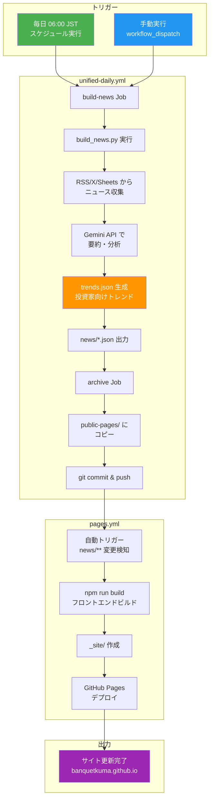

# Semiconductor News

[](https://github.com/BanquetKuma/Power-Semiconductor-News/actions/workflows/unified-daily.yml)
[](https://github.com/BanquetKuma/Power-Semiconductor-News/actions/workflows/pages.yml)

**サイトURL**: https://banquetkuma.github.io/Power-Semiconductor-News/

半導体業界の最新ニュースを自動収集・AI分析・分野別分類・配信するシステム。

## 特徴

- **4軸20分野の自動分類**: デバイス種類/製造工程/市場用途/業界構造で分類
- **投資家向けトレンド分析**: Gemini AIによるメタトレンド抽出・市場シグナル生成
- **分野別JSON出力**: power.json, memory.json, automotive.json 等を自動生成
- **パフォーマンス最適化**: 並列処理による高速収集（従来比87%短縮）
- **自動化**: GitHub Actionsによる日次自動更新（毎日06:00 JST）

---

## デプロイフロー

GitHub Pagesが更新される仕組みを図解します。



### シンプル版フロー図

```
┌─────────────────────────────────────────────────────────────┐
│  unified-daily.yml (毎日 06:00 JST / 手動実行)              │
├─────────────────────────────────────────────────────────────┤
│  1. build_news.py 実行                                      │
│     ├─ RSS/X/Google Sheets からニュース収集                 │
│     ├─ Gemini API で要約・分類                              │
│     └─ trends.json 生成（投資家向けメタトレンド）           │
│                                                             │
│  2. news/*.json を public-pages/ にコピー                   │
│                                                             │
│  3. git commit & push                                       │
└─────────────────────────────────────────────────────────────┘
                              │
                              ▼ (push トリガー)
┌─────────────────────────────────────────────────────────────┐
│  pages.yml (自動実行)                                       │
├─────────────────────────────────────────────────────────────┤
│  1. npm run build (フロントエンドビルド)                    │
│  2. _site/ に dist/ と news/ をコピー                       │
│  3. GitHub Pages にデプロイ                                 │
└─────────────────────────────────────────────────────────────┘
                              │
                              ▼
┌─────────────────────────────────────────────────────────────┐
│  https://banquetkuma.github.io/Power-Semiconductor-News/    │
└─────────────────────────────────────────────────────────────┘
```

---

## セットアップ

### 必要な環境変数 (GitHub Actions Secrets)

| 変数名 | 必須 | 説明 |
|--------|------|------|
| `GOOGLE_API_KEY` | 推奨 | Gemini API キー（要約・トレンド分析） |
| `OPENAI_API_KEY` | 任意 | OpenAI API キー（Geminiのフォールバック） |
| `X_BEARER_TOKEN` | 任意 | X (Twitter) API トークン |

### ローカル開発

```bash
# Python依存関係のインストール
pip install -r requirements.txt

# ニュースJSONのビルド
python script/build_news.py

# フロントエンド開発
cd frontend
npm install
npm run dev      # 開発サーバー起動
npm run build    # 本番ビルド
```

---

## プロジェクト構成

```
Power-Semiconductor-News/
├── script/
│   └── build_news.py        # ニュースビルダー（メイン処理）
├── frontend/
│   ├── src/
│   │   ├── components/
│   │   │   ├── Header.tsx       # ヘッダー（タブ切替）
│   │   │   ├── TrendsView.tsx   # 投資家向けトレンドページ
│   │   │   ├── TrendCard.tsx    # トレンドカード
│   │   │   ├── MarketSignals.tsx # 市場シグナル表示
│   │   │   └── ViewToggle.tsx   # ビュー切替タブ
│   │   ├── stores/
│   │   │   └── newsStore.ts     # Zustand状態管理
│   │   └── types/
│   │       └── news.ts          # 型定義
│   └── public/
│       ├── news/                # ニュースJSONファイル
│       └── assets/              # 画像アセット
├── news/                        # 生成されるニュースJSON
├── public-pages/                # デプロイ用ファイル
├── .github/workflows/
│   ├── unified-daily.yml        # 統合日次パイプライン
│   └── pages.yml                # GitHub Pages デプロイ
├── sources.yaml                 # ニュースソース設定
└── requirements.txt             # Python依存関係
```

---

## 分野分類（4軸20分野）

### デバイスの種類
| 分野 | ファイル | キーワード例 |
|------|---------|-------------|
| パワー半導体 | `power.json` | SiC, GaN, IGBT, MOSFET |
| メモリ半導体 | `memory.json` | DRAM, NAND, HBM |
| ロジック半導体 | `logic.json` | CPU, GPU, FPGA, ASIC |
| アナログ半導体 | `analog.json` | センサ, PMIC, ADC |
| イメージセンサ | `image.json` | CMOSセンサ, CCD |

### 市場・アプリケーション
| 分野 | ファイル | キーワード例 |
|------|---------|-------------|
| AI半導体 | `ai.json` | AIチップ, アクセラレータ |
| 車載半導体 | `automotive.json` | 自動運転, ADAS, EV |
| データセンター | `datacenter.json` | サーバ, クラウド |
| 産業機器 | `industrial.json` | IoT, FA |

### 業界構造
| 分野 | ファイル | キーワード例 |
|------|---------|-------------|
| ファウンドリ | `foundry.json` | TSMC, Samsung, Rapidus |
| ファブレス | `fabless.json` | NVIDIA, Qualcomm, AMD |
| 地政学・規制 | `geopolitics.json` | CHIPS法, 輸出規制 |

---

## GitHub Actions ワークフロー

| ワークフロー | 実行タイミング | 処理内容 |
|-------------|---------------|---------|
| `unified-daily.yml` | 毎日 06:00 JST / 手動 | ニュース収集・トレンド分析・コミット |
| `pages.yml` | mainへのpush時 / 手動 | GitHub Pagesへデプロイ |
| `twitter-post.yml` | 毎日 08:30 JST / 手動 | X（Twitter）へ自動投稿 |

### 手動実行方法

```bash
# ニュース収集〜デプロイまで全て実行
gh workflow run unified-daily.yml

# デプロイのみ実行
gh workflow run pages.yml

# Xへ投稿（dry-run）
gh workflow run twitter-post.yml -f dry_run=true

# Xへ投稿（本番）
gh workflow run twitter-post.yml
```

---

## X（Twitter）自動投稿機能

毎日08:30 JSTに、Geminiが生成したバズるツイートを自動投稿します。

### 投稿フロー

```
┌─────────────────────────────────────────┐
│  08:30 JST twitter-post.yml 実行        │
└─────────────────────────────────────────┘
           │
           ▼
┌─────────────────────────────────────────┐
│  Gemini がツイート文を生成              │
│  「🔥 SiC半導体、EV需要で爆発的成長！   │
│   Infineonが生産能力2倍に #半導体」     │
└─────────────────────────────────────────┘
           │
           ▼
┌─────────────────────────────────────────┐
│  X API でツイート投稿                   │
│  → リプライでサイトリンクを投稿         │
└─────────────────────────────────────────┘
```

### 必要な Secrets（X投稿用）

| Secret名 | 説明 |
|----------|------|
| `X_API_KEY` | X API Key (Consumer Key) |
| `X_API_SECRET` | X API Secret (Consumer Secret) |
| `X_ACCESS_TOKEN` | X Access Token |
| `X_ACCESS_SECRET` | X Access Token Secret |

### X API キーの取得方法

1. [X Developer Portal](https://developer.twitter.com/) でアカウント作成
2. Free プランで App を作成
3. User authentication settings で Read and Write 権限を付与
4. Keys and tokens から上記4つの値を取得

---

## ライセンス

MIT License
